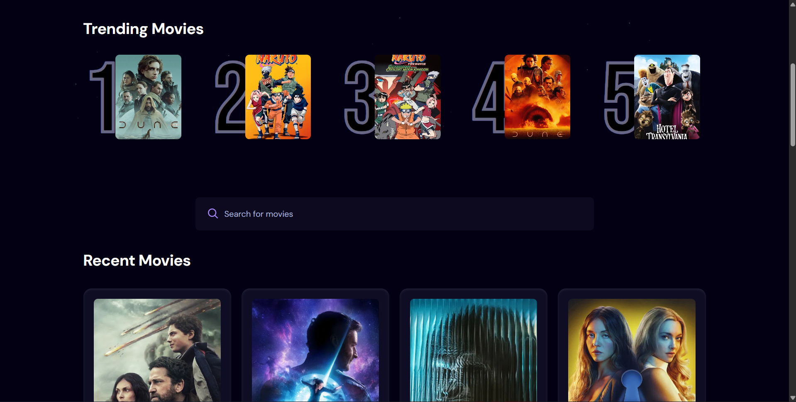

# 🎬 React Movie Website



A movie browsing web application built with React and Vite that allows users to explore movie information through a clean and responsive UI.

This project focuses on API integration, component-based UI design, and modern frontend development practices.

---

## 🚀 Live Demo

https://react-movie-website-plum.vercel.app/

---

## 🧰 Tech Stack


---

## ✨ Features

- Browse movies
- Movie poster display
- Responsive layout
- Component-based UI
- API-driven content
- Fast Vite development environment

---

## 📁 Project Structure

```
React_Movie_Website
│
├── public
├── src
│ ├── components
│ ├── supabase.js
│ ├── index.css
│ └── App.jsx
│
├── index.html
├── package.json
└── vite.config.js
```

---


## 🧠 What I Learned

- Building React applications with Vite
- Fetching data from APIs
- Component architecture
- Responsive UI design
- State management basics

---

## 👨‍💻 Author

Sethu   
Frontend Developer in progress

